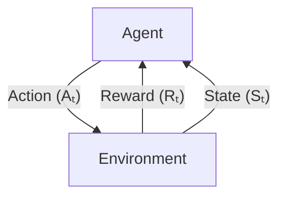

<section class="relative mb-4 break-inside-avoid-column overflow-hidden rounded-md bg-zinc-50 px-4 py-2 dark:bg-zinc-800" markdown="1">

{% svg /assets/images/streamline/neural-swarm-1.svg width="100%" height="100%" %}

# Machine Learning

This cheatsheet attempts to give a high-level overview of the incredibly large field of Machine Learning. Please [contact me](https://twitter.com/tlyleung) for corrections/omissions.

*Last updated: 1 January 2024*
</section>

<section class="relative mb-4 break-inside-avoid-column overflow-hidden rounded-md bg-zinc-50 px-4 py-2 dark:bg-zinc-800" markdown="1">

{% svg /assets/images/streamline/book-flip-page.svg width="100%" height="100%" %}

# Contents

- [Background](#background)
- [Machine Learning Lifecycle](#machine-learning-lifecycle)
- [Problem Framing](#problem-framing)
- [Data Assembly](#data-assembly)
- [Model Training](#model-training)
  - [PyTorch](#model-training-pytorch)
- Model Evaluation
  - [Responsible AI](#model-evaluation-responsible-ai)
  - [Metrics](#model-evaluation-metrics)
- Models
  - [Supervised Learning](#models-supervised-learning)
  - [Unsupervised Learning](#models-unsupervised-learning)
  - [Reinforcement Learning](#models-reinforcement-learning)
  - [Recommender Systems](#models-recommender-systems)
  - [Ensembles](#models-ensembles)
  - [Tasks](#models-tasks)
</section>

<section class="relative mb-4 break-inside-avoid-column overflow-hidden rounded-md bg-zinc-50 px-4 py-2 dark:bg-zinc-800" markdown="1">

{% svg /assets/images/streamline/official-building-3.svg width="100%" height="100%" %}

# Background

- Artificial Intelligence is the ability of a machine to demonstrate human-like intelligence.
- Machine Learning is the field of study that gives computers the ability to learn without explicitly being programmed.
- Machine Learning has become possible because of:
  - Massive labelled datasets, e.g. ImageNet
  - Improved hardware and compute, e.g. GPUs
  - Algorithms advancements, e.g. backpropagation

</section>

<section class="relative mb-4 break-inside-avoid-column overflow-hidden rounded-md bg-zinc-50 px-4 py-2 dark:bg-zinc-800" markdown="1">

{% svg /assets/images/streamline/synchronize-arrows-three.svg width="100%" height="100%" %}

# Machine Learning Lifecycle

1. Problem Framing
2. Data Assembly
3. Model Training
4. Model Evaluation
5. Model Deployment

</section>

<section class="relative mb-4 break-inside-avoid-column overflow-hidden rounded-md bg-zinc-50 px-4 py-2 dark:bg-zinc-800" markdown="1">

{% svg /assets/images/streamline/bulb-1.svg width="100%" height="100%" %}

# Problem Framing

1. Identify business objective
2. Review existing datasets
3. Determine constraints (see below)
4. Frame business object as a Machine Learning task
5. Define success metrics
6. Specify the model's inputs and outputs
 
---

## When to use Machine Learning?[^huyen22]

Machine Learning is an approach to <u>learn</u> <u>complex patterns</u> from <u>existing data</u> and use these <u>patterns</u> to make <u>predictions</u> on <u>unseen data</u>.

- **Learn:** the system has the capacity to learn.
- **Complex patterns:** there are patterns to learn and they are complex.
- **Existing data:** data is available or it's possible to collect data.
- **Predictions:** it's a predictive problem.
- **Unseen data:** unseen data shares patterns with the training data.

Machine Learning systems work best when:

- Data is repetitive
- Cost of wrong predictions is cheap
- Problem is at scale
- Patterns are constantly changing

---

## Constraints[^cs329s][^mlsystemdesign]

### Performance

- Cost of wrong predictions
- False negatives vs. false positives
- Interpretability
- Usefulness threshold

### Training

- Freshness requirements
- Training frequency

### Inference

- Computing power
- Confidence measurement (if confidence is below threshold: discard, clarify or refer to humans?)
- Cost
- Number of items
- Number of users
- Latency
- Peak requests

### Online vs. Batch

- **Online:** generate predictions as requests arrive, e.g. speech recognition
- **Batch:** generate predictions periodically before requests arrive, e.g. Netflix recommendations

### Cloud vs. Edge vs. Hybrid

- **Cloud:** no energy, power or memory constraints
- **Edge:** can work without unreliable connections, no network latency, fewer privacy concerns, cheaper
- **Hybrid:** common predictions are precomputed and stored on device

### Privacy

- **Annotations:** can data be shipped to outside organisations?
- **Storage:** what data are you allowed to store and for how long?
- **Third-party:** can you share data with a third-party?
- **Regulations:** is the data complying with relevant data protection laws?

</section>

<section class="relative mb-4 break-inside-avoid-column overflow-hidden rounded-md bg-zinc-50 px-4 py-2 dark:bg-zinc-800" markdown="1">

{% svg /assets/images/streamline/database-2.svg width="100%" height="100%" %}

# Data Assembly

1. **Data Collection:** (see below)
2. **Exploratory Data Analysis (EDA):** use visualisation and statistical techniques to understand the data's structure, detect patterns and spot anomalies
3. **Data Preprocessing:** (see below)
4. **Feature Engineering:** (see below)
5. **Feature Selection:** remove features with low variance, recursive feature elimination, sequential feature selection
6. **Sampling Strategy:** sequential, random, stratified, weighted, reservoir, importance
7. **Data Splits:** train-test-validation split, windows splitting of time series data

---

## Class Imbalance[^cs329s]

### Collect More Data

- Target under-represented classes

### Data-level Methods

- Undersample majority class (can cause overfitting), e.g. Tomek Links makes decision boundaries clearer by finding pairs of close samples from opposite classes and removes the majority sample 
- Oversample minority class (can cause loss of information), e.g. generate synthetic minority oversampling (SMOTE)

### Algorithm-level Methods

- Cost-sensitive learning penalises the misclassification of minority class samples more heavily than majority class samples
- Class-balance loss by giving more weight to rare classes
- Focal loss by giving more weight to difficult samples

---

## Data Collection[^data_checklist]

Good data should:
- have good predictive power (an expert should be able to make a correct prediction with the data)
- have very little missing values (when missing values do occur, they should be explainable and occur randomly)
- be labelled
- be correct and accurate
- be documented
- be unbiased

### Data Biases[^cs329s]

- Sampling/selection bias
- Under/over representation of subgroups
- Human biases embedded in the data
- Labelling bias
- Algorithmic bias

### Data Labelling[^cs329s]

- Hand-labelling, data lineage (track where data/labels come from)
- Use Labelling Functions (LFs) to label training data programmatic using different heuristics, including pattern matching, boolean search, database lookup, prediction from legacy system, third-party model, crowd labels
- Weak supervision, semi supervision, active learning, transfer learning

---

## Data Leakage[^cs329s]

- Splitting time-correlated data randomly instead of by time
- Preprocessing data before splitting, e.g. using the whole dataset to generate global statistics like the mean and using it to impute missing values
- Poorly handling of data duplication before splitting
- Group leakage, group of examples have strongly correlated labels but are divided into different splits
- Leakage from data collection process, e.g. doctors sending high-risk patients to a better scanner
- Detect data leakage by measuring correlation of a feature with labels, feature ablation study, monitoring model performance when new features are added

---

## Data Preprocessing[^sklearn]

### Missing Data

- Collect more data
- Drop row/column
- Constant imputation
- Univariate imputation: replace missing values with the column mean/median/mode
- Multivariate imputation: use all available features to estimate missing values
- Nearest neighbours imputation: use an euclidean distance metric to find nearest neighbors
- Add missing indicator column

### Missing Values

- **Missing Not At Random (MNAR):** missing due to the value itself
- **Missing At Random (MAR):** missing due to another observed variable
- **Missing Completely At Random (MCAR):** no pattern to which values are missing

### Structured Data

- **Categorical:** ordinal encoding, one-hot encoding
- **Numeric:** discretisation, min-max normalisation, z-score normalisation (when variables follow a normal distribution), log scaling (when variables follow an exponential distribution), power transform (mapping to Gaussian distribution using Yeo-Johnson or Box-Cox transforms)

### Unstructured Data

- **Audio:** sampling, noise reduction, normalisation, feature extraction, silence removal
- **Images:** decoding, resizing, normalisation, augmentation
- **Text:** normalisation (lower-casing, punctuation removal, strip whitespaces, strip accents, lemmatisation and stemming), tokenisation, token to IDs, stopword removal
- **Videos:** frame extraction, resizing, normalisation, optical flow analysis, augmentation

---

## Feature Engineering[^sklearn]

Use domain knowledge to extract and transform predictive features from raw data into a format usable by the model.

- **Dimensionality Reduction:** use Principal Component Analysis (PCA) to find a subset of features that capture the variance of the original features or Hierarchical Clustering to group features that behave similarly.
- **Feature Crossing:** combine two or more features to create a new feature.
- **Positional Embeddings:** can be either learned or fixed at test time.

### Event Recommendation Example Features

- **Events:** type, price
- **Location:** walk score, transit score, same region, distance to event, venue capacity,
- **Social:** total attendance, friend attendance, invited by other user, hosted by a friend, attendance of events by same host, social media engagement
- **Time:** remaining time until event begins, estimated travel time, time of day, weekday vs. weekend, seasonality, frequency, duration
- **User:** age, gender, past attendance, event preferences, income bracket

</section>

<section class="relative mb-4 break-inside-avoid-column overflow-hidden rounded-md bg-zinc-50 px-4 py-2 dark:bg-zinc-800" markdown="1">

{% svg /assets/images/streamline/server-3.svg width="100%" height="100%" %}

# Model Training

1. Decide whether to train from scratch or fine-tune existing model
2. Choose loss function
3. Establish a simple baseline
4. Experiment with simple models
5. Switch to more complex models
6. Use an ensemble of models
7. Employ distributed training

---

## Key Concepts

- **Bias and Variance:** Bias refers to the error introduced by approximating a real-world problem with a simplified model. High bias can cause an algorithm to miss relevant relations between features and target outputs (underfitting). Variance refers to the amount by which a model would change if estimated using a different training dataset. High variance can cause an algorithm to model random noise in the training data, not the intended outputs (overfitting).

  

  
Low Bias

  
High Bias

  
Low Variance

  


  


  
High Variance

  


  


- **Bias-Variance Trade-off:** As you increase the complexity of your model, you will typically decrease bias but increase variance. On the other hand, if you decrease the complexity of your model, you increase bias and decrease variance. 

- **Curse of Dimensionality:** As the number of features in a dataset increases, the volume of the feature space increases so fast that the available data becomes sparse. This makes it hard to have enough data to give meaningful results, leading to overfitting.

- **Learning Curve:** Model performance as a function of number of training examples, can be good for estimating if performance can be improved with more data

- **Overfitting and Underfitting:** overfitting occurs when a model learns the training data too well and can't generalise to unseen data, while underfitting happens when a model isn't powerful enough to model the training data.

  

  
Classification

  
Regression

  
Underfit

  


  


  
Good Fit

  


  


  
Overfit

  


  


- **Universal Approximation Theorem:** A neural network with a single hidden layer can approximate any continuous function for inputs within a specific range

- **Vanishing/Exploding Gradients:** When training a deep neural network, if the gradient values become very small, they get "squashed" due to the activation functions resulting in vanishing gradients. When these small values get multiplied during backpropagation they can become near zero, which results in a lack of updates to the network weights and the training stalling. On the other hand, if the gradients become too large, they "explode", causing model weights to update too drastically and making model training unstable.

---

## Cross-validation[^sklearn] (CV)

- **K-fold:** divide samples into $$k$$ folds; train model on $$k-1$$ folds and evaluate using the left out fold 
- **Leave One Out (LOO):** train model on all samples except one and evaluate using the left out sample
- **Stratified K-fold:** similar to K-fold, but each fold contains the same class balance as the full dataset
- **Group K-fold:** similar to K-fold, but ensure that groups (samples from the same data source) do not span different folds
- **Time Series Split:** to ensure only past observations are used to predict future observations, train model on first $$n$$ folds and evaluate on the $$n+1$$-th fold

---

## Hyperparameter Optimisation (HPO)

- **Grid search:** exhaustively search within bounds
- **Random search:** randomly search within bounds
- **Bayesian search:** modeled as Gaussian process

---

## Model Selection

1. Avoid the state-of-the-art trap; a state-of-the-art model only means that it performs better than existing models  on some static datasets
2. Start with the simplest models, since they are: (i) easier to deploy; (ii) can be iterated on which aids interpretability; and (iii) can serve as a baseline  
3. Avoid human biases in selecting models
4. Evaluate good performance now versus good performance later
5. Evaluate trade-offs, e.g. false positives vs. false negatives or compute requirement vs. accuracy
6. Understand your model's assumptions, e.g. prediction assumption, IID, smoothness, tractability, boundaries, conditional independence, normally distributed

---

## Neural Architecture Search[^cs329s] (NAS)

- **Search Space:** set of operations, (e.g. convolutions, fully-connected layers, pooling, etc.) and how they can be connected
- **Search Strategy:** random, reinforcement learning, evolution

</section>

<section class="relative mb-4 break-inside-avoid-column overflow-hidden rounded-md bg-zinc-50 px-4 py-2 dark:bg-zinc-800" markdown="1">

{% svg /assets/images/streamline/trends-hot-flame.svg width="100%" height="100%" %}

# Model Training: PyTorch[^pytorch]

## Activations

  
Sigmoid 1 / (1 + e-x)

  


  
ReLU max(0,x)

  


  
Tanh tanh(x)

  


  
Leaky ReLU max(0.1x,x)

  


---

## Debugging

- Overfit model on a subset of data
- Look out for exploding gradients (use gradient clipping)
- Turn on `detect_anomaly` so that any backward computation that generates `NaN` will raise an error.

---

## Distances

### Cosine Distance

$$d_{\text{Cosine}}(p, q) = 1 - \frac{p \cdot q}{\|p\| \|q\|}$$

Use for high-dimensional, sparse data where only the direction matters, e.g., document similarity, word embeddings.

### Manhattan Distance (L1 Norm or Taxicab Distance)

$$d_{\text{Manhattan}}(p, q) = \sum_{i=1}^{n} |p_i - q_i|$$

Use when movement is constrained to a grid, e.g. pathfinding, recommendation systems.

### Euclidean Distance (L2 Norm or Pairwise Distance)

$$d_{\text{Euclidean}}(p, q) = \sqrt{\sum_{i=1}^{n} (p_i - q_i)^2}$$

Use when physical/geometric distance matters, e.g. dense data, clustering.

---

## Distributed Training

- **Data parallelism:** split the data across devices so that each device sees a fraction of the batch
- **Model parallelism:** split the model across devices so that each device runs a fragment of the model

---

## Initialisations

- **Kaiming:** sets the initial weights to account for the ReLU activation function by scaling the variance based on the number of input units, preventing vanishing gradients in deep networks.
- **Xavier:** initialises weights to keep the variance of activations uniform across layers by scaling the weights based on the number of input and output units, making it suitable for sigmoid and tanh activations.

---

## Layers

### Convolution Layers

- **Convolution:** Convolutional layers in PyTorch apply convolution operations to input data, using learnable filters (kernels) that slide over the input, detecting local features such as edges or textures in the case of images.

### Linear Layers

- **Linear:** A fully connected (dense) layer in PyTorch performs a linear transformation on the input by applying a weight matrix and adding a bias vector:

  $$\text{output} = \text{input} \times W^T + b$$

  It's typically used in the final layers of a neural network, allowing every input feature to connect to every output feature.

### Pooling Layers

- **Average pool:** takes the average of values within a pooling window, preserving spatial information by smoothing feature maps.
- **Max pool:** selects the maximum value within a pooling window, retaining the most prominent features while reducing dimensionality.
- **Adaptive max pool:** adjusts the pooling window size dynamically to output a fixed-sized feature map, regardless of input size.
- **Fractional max pool:** pools using non-integer strides, allowing for more flexible downsampling that preserves more information in deeper layers.

### Recurrent Layers

- **Recurrent Neural Network (RNN):** The basic RNN layer processes sequence data by maintaining a hidden state across time steps. It’s useful for tasks involving time-series, language, or any sequential data, however, they suffer from the vanishing gradient problem, which can hinder learning over long sequences.
- **Long short-term memory (LSTM):** LSTMs improve upon standard RNNs by using three gates (input gate, forget gate, and output gate) and a memory cell to selectively retain or discard information over time, which helps avoid the vanishing gradient problem.
- **Gated recurrent unit (GRU):** GRUs improve upon standard RNNs by using two gates (reset gate and update gate) to control the flow of information, which helps solve the vanishing gradient problem, making it easier to capture dependencies over longer sequences without needing separate memory cells like LSTMs.

### Transformer Layers

- **Transformer:** The transformer layer is designed to handle sequential data without relying on recurrent structures. It uses a self-attention mechanism to learn relationships between different positions in the sequence, making it highly parallelisable and better suited for long-range dependencies than RNN-based models.
- **Transformer Encoder:** The encoder is one half of the transformer architecture, which processes input sequences into a rich set of representations. It consists of multiple layers of multi-head self-attention and position-wise feed-forward networks, which allow the model to understand context across the entire sequence.
- **Transformer Decode:** The decoder is the other half of the transformer architecture, used for tasks like sequence-to-sequence modeling (e.g., machine translation). It generates output sequences by attending to both the encoder's output and previous tokens of the output sequence, enabling it to produce context-aware predictions.

---

## Loss Functions

- **Cross-Entropy** measures how close the predicted probability distribution is with the true distribution. It is widely used in classification tasks, especially for multi-class problems, where it penalizes incorrect classifications based on how confident the model was in its predictions.

  $$l_n = - w_{y_n} \log \frac{\exp(x_{n,y_n})}{\sum_{c=1}^C \exp(x_{n,c})}$$
 
- **Connectionist Temporal Classification (CTC)** is used where the alignment between input and output sequences is unknown, such as in speech recognition or handwriting recognition, where the timing of outputs may not correspond directly to the inputs.

- **Huber Loss** is a combination of Mean Squared Error and Mean Absolute Error that is less sensitive to outliers than MSE. It behaves as MSE when the error is small and as MAE when the error is large.

  $$l_n = \begin{cases} \frac{1}{2}(x_n - y_n)^2 & \text{if } |x_n - y_n| < \delta, \\ \delta(|x_n - y_n| - \frac{1}{2}\delta) & \text{otherwise,}\end{cases}$$

  where $$\delta$$ is a threshold defining when to switch between the two behaviors.

- **Kullback–Leibler (KL) Divergence** measures of how one probability distribution diverges or is different from a second, expected probability distribution. It is used for comparing probability distributions, often in generative models.

  $$L(y_{\text{pred}},\ y_{\text{true}})  = y_{\text{true}} \cdot (\log y_{\text{true}} - \log y_{\text{pred}})$$

- **Mean Absolute Error (L1)** measures the average of the absolute differences between the predicted and actual values. It is robust to outliers and focuses on minimizing large deviations.
 
  $$l_n = \left| x_n - y_n \right|$$

- **Mean Squared Error (Squared L2 Norm)** measures the average squared difference between the estimated values and the actual values. It penalizes larger errors more than smaller ones.

  $$l_n = \left( x_n - y_n \right)^2$$

- **Negative Log Likelihood (NLL)** measures the disagreement between the true labels and the predicted probability distributions, assigning a high penalty to incorrect classifications where the predicted probability was high.

  $$l_n = - w_{y_n} x_{n,y_n}$$

---

## Normalisation

  
Batch Norm

  


  
Layer Norm

  


  
Group Norm

  


  
Instance Norm

  


---

## Optimisers

- **Adagrad:** adapts the learning rate for each parameter based on its past gradients, making frequent updates smaller and rare updates larger.
- **Adam:** combines the benefits of momentum and RMSProp, using moving averages of both gradients and squared gradients to adapt learning rates.
- **Momentum:** accelerates gradients in the relevant direction by combining the current gradient with a fraction of the previous gradient, helping to avoid local minima.
- **RMSProp:** adjusts the learning rate for each parameter based on the moving average of squared gradients, preventing large oscillations in the update step.
- **Stochastic Gradient Descent (SGD):** updates parameters using only a random subset of data, reducing computation per update but introducing noise to the gradient estimation.

---

## Performance Tuning[^pytorch][^pytorch_lightning]

- Enable asynchronous data loading and augmentation using `num_workers > 0` and `pin_memory = True`
- Disable bias for convolutions before batch norms
- Use learning rate scheduler
- Use mixed precision
- Accumulate gradients by running a few small batches before doing a backward pass
- Saturate GPU by maxing-out batch size (downside: higher batch sizes may cause training to get stuck in local minima)
- Use Distributed Data Parallel (DDP) for multi-GPU training
- Clip gradients to avoid exploding gradients
- Disable gradient calculation for val/test/predict

---

## Regularisation

### Augmentation

- **Image:** random crop, saturation, flip, rotation, translation, perturb using random noise
- **Text:** swap with synonyms, add degree adverbs, perturb with random word replacements

### Data Synthesis

- **Image:** mixup (inputs and labels are linear combination of multiple classes)
- **Text:** template-based, language model-based

### Dropout

Randomly zeroes some elements of the input tensor with probability $$p$$, forcing the model to learn redundant representations and reducing the risk of overfitting.

### Early Stopping

Stops training when the model's performance on a validation set stops improving, preventing overfitting by stopping before the model starts memorizing noise.

### L1 Regularisation (Lasso)

Adds a penalty equal to the absolute value of the magnitude of the coefficients to the loss function. This results in sparse solutions by driving less important feature weights to zero, making it useful for feature selection

### L2 Regularisation (Ridge)

Adds a penalty equal to the square of the magnitude of the coefficients to the loss function. This discourages large weights and helps in reducing overfitting without driving coefficients to exactly zero.

</section>

<section class="relative mb-4 break-inside-avoid-column overflow-hidden rounded-md bg-zinc-50 px-4 py-2 dark:bg-zinc-800" markdown="1">

{% svg /assets/images/streamline/earth-2.svg width="100%" height="100%" %}

# Model Evaluation: Responsible AI

## Compactness

Reduces memory footprint and increases computation speed

- **Quantisation:** reduce model size by using fewer bits to represent parameters 
- **Knowledge distillation:** train a small model (student) to mimic the results of a larger model (teacher)
- **Pruning**: remove nodes or set least useful parameters to zero
- **Low-ranked factorisation:** replace convolution filters with compact blocks

---

## Explainability

- **Integrated Gradients:** compute the contribution of each feature to a prediction by integrating gradients over the path from the baseline
- **LIME (Local Interpretable Model-agnostic Explanations):** creates a simpler, interpretable model around a single prediction to explain how the model behaves at that specific instance.
- **Sampled Shapley:** estimates the contribution of each feature by averaging over subsets of features sampled from the input data.
- **SHAP (SHapley Additive exPlanations):** assigns each feature an importance value for a particular prediction, based on the concept of Shapley values from cooperative game theory
- **XRAI (eXplanation with Ranked Area Integrals):** segments an input image and ranks the segments based on their contribution to the model's prediction

---

## Fairness

- Slice-based evaluation, e.g. when working with website traffic, slice data among: gender, mobile vs. desktop, browser, location
- Check for consistency over time
- Determine slices by heuristics or error analysis

---

## Robustness

- **Determinism Test:** ensure same outputs when predicting using same model
- **Retraining Invariance Test:** ensure similar outputs when predicting using re-trained model
- **Perturbation Test:** ensure small changes to numeric inputs don't cause big changes to outputs
- **Input Invariance Test:** ensure changes to certain inputs don't cause changes to outputs
- **Directional Expectation Test:** ensure changes to certain inputs cause predictable changes to outputs
- **Ablation Test:** ensure all parts of the model are relevant for model performance
- **Fairness Test:** ensure different slices have similar model performance
- **Model Calibration Test:** ensure events should happen according to the proportion predicted

---

## Safety

- **Alignment:** ensuring that AI systems’ goals and behaviors are in accordance with human values and intentions, preventing them from acting in ways that could harm or be misaligned with user interests.
- **Existential Risk:** the potential risk that AI systems could lead to catastrophic outcomes that threaten the long-term survival or flourishing of humanity, such as uncontrolled superintelligent AI.
- **Red Teaming:** experts simulate potential attacks on a system to identify vulnerabilities, test defenses, and improve system security before actual attackers do.
- **Reward Hacking:** when an AI system finds unintended ways to maximize its reward function, leading to harmful or suboptimal outcomes that violate the intended goals.

</section>

<section class="relative mb-4 break-inside-avoid-column overflow-hidden rounded-md bg-zinc-50 px-4 py-2 dark:bg-zinc-800" markdown="1">

{% svg /assets/images/streamline/analytics-pie-2.svg width="100%" height="100%" %}

# Model Evaluation: Metrics

## Offline Metrics (Before Deployment)

### Baselines

- Predict at random (uniformly or following label distribution)
- Zero rule baseline (always predict the most common class)
- Simple heuristics
- Human baseline
- Existing solutions

### Classification

- **Confusion Matrix**

  |         | Class 1             | Class 2             |
  |---------|---------------------|---------------------|
  | **Class 1** | True-positive (TP)  | False-positive (FP) |
  | **Class 2** | False-negative (FN) | True-negative (TN)  |
  {: .table .table-striped }

- **Type I error:** FP
- **Type II error:** FN
- **Precision:** TP / (TP + FP), i.e. a classifier's ability not to label a negative sample as positive
- **True-positive rate (Recall or Sensitivity):** TP / (TP + FN), i.e. a classifier's ability to find all positive samples
- **True-negative rate (Specificity):** TN / (TN + FP), i.e. a classifier's ability to identify all negative samples
- **False-positive rate:** FP / (FP + TN), i.e. a classifier's inability to find all negative samples
- **F1 score:** 2 × precision × recall / (precision + recall), i.e. the harmonic mean of precision and recall
- **Precision-recall curve:** trade-off between precision and recall, a higher PR-AUC indicates a more accurate model
- **Receiver operator characteristic (ROC) curve:** trade-off between true-positive rate (recall) and false-positive rate, a higher ROC-AUC indicates a model better at distinguishing positive and negative classes

### Regression
- **Mean squared error (MSE):** average of the squared differences between the predicted and actual values, emphasising larger errors
- **Mean absolute error (MAE):** average of the absolute differences between the predicted and actual values, treating all errors equally
- **Root mean square error (RMSE):** square root of the MSE, providing error in the same units as the predicted and actual values and emphasizing larger errors like MSE

### Object Recognition

- **Intersection over union (IOU):** ratio of overlap area with union area

### Ranking

- **Recall@k:** proportion of relevant items that are included in the top-k recommendations
- **Precision@k:** proportion of top-k recommendations that are relevant
- **Mean reciprocal rank (MRR):** $$\frac{1}{m} \sum_{i=1}^m \frac{1}{\textrm{rank}_i}$$, i.e. where is the first relevant item in the list of recommendations?
- **Hit rate:** how often does the list of recommendations include something that's actually relevant?
- **Mean average precision (mAP):** mean of the average precision scores for each query
- **Diversity:** measure of how different the recommended items are from each other
- **Coverage:** what's the percentage of items seen in training data that are also seen in recommendations?
- **Cumulative gain (CG):** $$\sum_{i=1}^p rel_i$$, i.e. sum of relevance scores obtained by a set of recommendations
- **Discounted cumulative gain (DCG):** $$\sum_{i=1}^p \frac{\textrm{rel}_i}{\log_2(i+1)}$$, i.e. CG discounted by position
- **Normalised discounted cumulative gain (nDCG):** $$\frac{\textrm{DCG}_p}{\textrm{IDCG}_p}$$, i.e. extension of CG that accounts for the position of the recommendations (discounting the value of items appearing lower in the list), normalised by maximum possible score

### Image Generation

- **Fréchet Inception Distance (FID):** measures the distance between the feature distributions of generated images and real images using a pre-trained Inception model. Used to assess the quality and realism of generated images by comparing them with real-world images.
- **Inception score:** calculates how confidently the model can classify generated images and measures how diverse the generated images are across categories. Used to assess how well the generated images align with recognizable classes, balancing image quality and diversity.

### Fluency

- **Perplexity:** measures how well a language model predicts the next token in a sequence, representing the model's uncertainty. Used to evaluate the fluency and coherence of a language model in predicting sequences of words or tokens.

### Summarisation[^yan24]

- **Factual consistency:** finetune a Natural Language Inference (NLI) model to predict whether the hypothesis sentence is entailed by (logically flows from), neutral to or contradicts the premise sentence.

- **Sentiment consistency:** for each key aspect, does the summary accurately reflect the sentiment for each key aspect?

- **Aspect relevance:** does the summary cover the main topics discussed?

- **Length adherence:** does the summary meet a word or character limit?

### Translation[^yan24]

- **Character n-gram F-score (chrF):** compute the precision and recall of character n-grams between the machine translation (MT) and the reference translation.

- **BLEURT:** compute the similarity between the machine translation (MT) and the reference translation using a pre-trained BERT model.

### Copyright Regurgitation[^yan24]

- **Exact regurgitation:** compute the length of the longest common subsequence (LCS) between the generated text and the copyright reference, normalised by the length of the input prompt.

- **Near-exact reproduction:** copmute the edit distance between the generated text and the copyright reference, normalised by the length of the input prompt.

### Toxicity[^yan24]

- **Toxicity score:** proportion of generated output that is classified as harmful, offensive or inappropriate.

---

## Online Metrics (After Deployment)[^mlsystemdesign]

### Examples

- **Event recommendation:** conversion rate, bookmark rate, revenue lift
- **Friend recommendation:** number of requests per day, number of requests accepted per day
- **Harmful content detection:** prevalence, harmful impressions, valid appeals, proactive rate, user reports per harmful class
- **Video recommendations:** click-through-rate, video completion rate, total watch time, explicit user feedback

</section>

<section class="relative mb-4 break-inside-avoid-column overflow-hidden rounded-md bg-zinc-50 px-4 py-2 dark:bg-zinc-800" markdown="1">

{% svg /assets/images/streamline/space-rocket-flying.svg width="100%" height="100%" %}

# Model Deployment

## Continual Learning

- Continually adapt models to changing data distributions
- Faced with challenges of access to fresh data, continuous evaluation and algorithms suited to fine-tuning and incremental learning

### Stages

1. **Manual, stateless retraining:** initial manual workflow.
2. **Automated retraining:** requires writing a script to automate workflow and configure infrastructure automatically, good availability and accessibility of data, and a model store to automatically version and store all the artefacts needed to reproduce a model.
3. **Automated, stateful retraining:** requires reconfiguring the updating script and the ability to track data and model lineage.
4. **Continual learning:** requires mechanism to trigger model updates and a pipeline to continually evaluated model updates.

---

## Deployment Strategies (B to replace A)

- **Recreate strategy:** stop A, start B
- **Ramped strategy:** shift traffic from A to B behind same endpoint
- **Blue/green:** shift traffic from A to B using different endpoint

---

## ML-specific Failures[^cs329s]

Train-serving skew is when a model performs well during development but poorly after production. It can be caused by:

### Upstream Drift

Caused by a discrepancy between how data is handled in the training and serving pipelines (should log features at serving time)[^ml_rules]

### Data Distribution Shifts

Model may perform well when first deployed, but poorly over time (can be sudden, cyclic or gradual).

- **Feature/covariate shift:** change in the distribution of input data, $$P(X)$$, but relationship between input and output, $$P(Y \vert X)$$, remains the same.
  - In training, can be caused by changes to data collection, e.g. if early data is from urban customers, and later data comes from rural customers.
  - In production, can be caused by changes to external factors, e.g. when predicting sales from weather, if weather patterns change (more rainy days), but the relationship between weather and sales remains constant (rainy days always lead to fewer sales).
- **Label shift:** change in the distribution of output labels, $$P(Y)$$, but relationship between output and input, $$P(X \vert Y)$$, remains the same.
  - E.g. when predicting diseases, if a disease becomes more common, but symptoms for each disease remains constant.
- **Concept drift:** change in the relationship between input and output, $$P(Y \vert X)$$, but the distribution of input data, $$P(X)$$, remains the same.
  - E.g. when predicting rain from cloud patterns, if the cloud patterns remain the same but their association with rain changes (maybe due to climate change).

### Degenerate Feedback Loops

When predictions influence the feedback, which is then used to extract labels to train the next iteration of the model,

### Examples

- **Recommender system:** originally, A is ranked marginally higher than B, so the model recommends A. After a while, A is ranked much higher than B. Can be detected using Average Recommended Popularity (ARP) and Average Percentage of Long Tail Items (APLT).
- **Resume screening:** originally, model thinks X is a good feature, so the model recommends resume with X. After a while, hiring managers only hires people with X and model confirms X is good. Can be mitigated using randomisation and positional features.

---

## Model Monitoring

Model monitoring is essential because while traditional software systems fail explicitly (error messages), Machine Learning systems fail silently (bad outputs)

### Operation-related Metrics

- Latency
- Throughput
- Requests per minute/hour/day
- Percentage of successful requests
- CPU/GPU utilisation
- Memory utilisation
- Availability

### ML-related Metrics[^cs329s]

- Feature and label statistics, e.g. mean, median, variance, quantiles, skewness, kurtosis, etc.
- Task-specific online metrics

---

## Myths[^huyen22]

1. You only deploy one or two models at a time
2. If we don't do anything, model performance remains the same
3. You won't need to update your models as much
4. Most ML engineers don't need to worry about scale

---

## Testing Strategies

- **Canary:** targeting small set of users with latest version.
- **Shadow:** mirror incoming requests and route to shadow application.
- **A/B:** route to new application depending on rules or contextual data.
- **Interleave:** mix recommendations from A and B and see which recommendations are clicked on.

</section>

<section class="relative mb-4 break-inside-avoid-column overflow-hidden rounded-md bg-zinc-50 px-4 py-2 dark:bg-zinc-800" markdown="1">

{% svg /assets/images/streamline/brain-1.svg width="100%" height="100%" %}

# Models: Supervised Learning[^isl][^sklearn]

Supervised learning models make predictions after seeing lots of data with the correct answers. The model discovers the relationship between the data and the correct answers.

## Regression

Regression models predict a numeric value.

### Linear Regression

$$\hat{y}(x) = \beta_0 + \beta_1 X_1 + \beta_2 X_2 + \ldots + \beta_p X_p + \epsilon$$

- Linear regression models the relationship between the target and predictors as a straight line.
- Parameters are estimated by minimising the Residual Sum of Squares (RSS): $$RSS = \sum_{i=1}^{n} (y_i - \hat{y}_i)^2$$
- Use when the relationship between features and the target is approximately linear.

### Regression Trees

$$\hat{y}(x) = \frac{1}{|R_j|} \sum_{i \in R_j} y_i \quad \text{if} \, x \in R_j$$

- Regression trees split the feature space into regions and predict the average of observations within each region.
- The tree splits are chosen to minimise the RSS in the resulting regions.
- Use when the relationship between features and the target is non-linear, and you prefer a model that is easy to interpret.

### Support Vector Regressor (SVR)

$$\hat{y}(x) = w^T x + b \quad \text{for points within the} \, \epsilon \, \text{margin}$$

- The Support Vector Regressor (SVR) fits a margin around the data points and penalises observations that fall outside the margin.
- Parameters are estimated by solving a quadratic optimisation problem to maximize the margin and penalize points outside the margin.
- Use when the relationship between features and the target is complex and when outliers need to be managed by a margin.

---

## Classification

Classification models predict the likelihood that something belongs to a category.

### Nearest Neighbours

$$\hat{y}(x) = \arg\max_{c \in C} \sum_{i \in N_k(x)} I(y_i = c)$$

- The k-Nearest Neighbours (k-NN) algorithm assigns the class that is most frequent among the $$k$$ closest observations in the feature space.
- No explicit training; classification is based on the majority class among the nearest neighbors using distance metrics.
- Use when there's no assumption about the underlying distribution of the data and when simplicity is desired.
- Algorithm can either be exact or approximate:
  - Clustering-based (e.g. HNSW): group points into clusters based on similarity, then search for neighbors only within relevant clusters, reducing the search space.
  - Locality-sensitivity hashing (LSH): uses a hash function to map similar points to the same bucket, enabling efficient approximate search in high-dimensional spaces.
  - Tree-based (e.g. $$k$$-d Tree): organize data into a hierarchical structure, allowing efficient nearest-neighbor search by pruning partitions that cannot contain the nearest neighbors.

### Logistic Regression

$$\hat{y}(x) = \frac{1}{1 + e^{-(\beta_0 + \beta_1 X_1 + \ldots + \beta_p X_p)}}$$

- Logistic regression models the probability that an observation belongs to a particular class, with the logistic function constraining the output between 0 and 1.
- Parameters are estimated by Maximum Likelihood Estimation (MLE), which maximises the probability of the observed data.
- Use when the relationship between the features and the probability of class membership is approximately linear on the log-odds scale.

### Linear Discriminant Analysis (LDA)

$$\hat{y}(x) = \arg\max_k \left( \log(\pi_k) - \frac{1}{2} \log |\Sigma| - \frac{1}{2} (x - \mu_k)^T \Sigma^{-1} (x - \mu_k) \right)$$

- Linear Discriminant Analysis (LDA) assumes that different classes generate data based on multivariate normal distributions with class-specific means and a shared covariance matrix.
- Parameters are estimated by calculating class means, the shared covariance matrix, and the prior probabilities for each class.
- Use when the data is approximately normally distributed, and the classes have similar covariance matrices.

### Classification Trees

$$\hat{y}(x) = \arg\max_{c \in C} \hat{p}_{mc} \quad \text{where} \, x \in R_m$$

- Classification trees split the feature space into regions where each region is assigned the most common class.
- The tree splits are chosen to maximise information gain, using metrics such as Gini impurity or entropy.
- Use when you need a simple, interpretable model that can handle both non-linear relationships and categorical features.

### Support Vector Classifier (SVC)

$$\hat{y}(x) = \text{sign}(w^T x + b)$$

- The Support Vector Classifier (SVC) finds the hyperplane that best separates the data into classes by maximising the margin between them.
- Parameters are estimated by solving a quadratic optimization problem to maximize the margin while allowing for some misclassification via slack variables.
- Use when the data is complex and not linearly separable, and you need a robust classifier with regularization to avoid overfitting.

---

## Variants

### Active Learning

Model selects the most informative samples to be labeled by an oracle (e.g. a human expert) to improve learning efficiency.

### Contrastive Learning

Learning by distinguishing between similar and dissimilar data points.

### Few-Shot Learning

Learning from very few labeled examples, often using meta-learning.

### Meta-Learning

Learning across multiple tasks to generalize better to new, unseen tasks with limited data.

### Self-Supervised Learning

Model generates its own labels from unlabeled data using pretext tasks.

### Semi-supervised Learning

Learning from a dataset with a small amount of labeled data and a large amount of unlabeled data, leveraging structure in the unlabeled examples.

### Weakly Supervised Learning

Learning from data with imperfect, noisy, or incomplete labels.

</section>

<section class="relative mb-4 break-inside-avoid-column overflow-hidden rounded-md bg-zinc-50 px-4 py-2 dark:bg-zinc-800" markdown="1">

{% svg /assets/images/streamline/hierarchy-9.svg width="100%" height="100%" %}

# Models: Unsupervised Learning

Unsupervised learning involves finding patterns and structure in input data without any corresponding output data.

## Clustering

Clustering is used to group observations into clusters, where observations within the same cluster are more similar to each other than to those in different clusters.

### Hierarchical Clustering

$$ \hat{y}(x) = \text{Cluster assignment based on dendrogram} $$

- Hierarchical clustering builds a tree-like structure (dendrogram) of nested clusters either from individual points up (agglomerative) or from one large cluster down (divisive).
- No explicit parameter estimation required; clusters are formed by successively merging or splitting based on a linkage criterion (e.g., complete, single, or average linkage).
- Use when you want to explore data structure at different levels of granularity and do not need to pre-specify the number of clusters.

### K-Means Clustering

$$ \hat{y}(x) = \arg\min_{k} ||x - \mu_k||^2 $$

- K-Means Clustering partitions the data into $$K$$ clusters by assigning each point to the nearest cluster centroid and updating centroids iteratively to minimise the within-cluster sum of squares (WCSS).
- Centroids are updated iteratively by minimising the within-cluster sum of squares (WCSS): $$WCSS = \sum_{k=1}^{K} \sum_{i \in C_k} \lVert x_i - \mu_k \rVert ^2$$, where $$\mu_k$$ is the centroid of cluster $$C_k$$.
- Use when you know the number of clusters in advance and the clusters are roughly spherical and evenly sized.

### Latent Dirichlet Allocation (LDA)

$$ \hat{y}(x) = \arg\max_{z_i} P(z_i | d, \theta_d, \phi_z) $$

- Latent Dirichlet Allocation (LDA) assumes that documents are mixtures of topics, and topics are distributions over words. It assigns each word in a document to a latent topic.
- Parameters (topic distributions and word distributions) are estimated using variational inference or Gibbs sampling. The key parameters are $$\theta_d$$ (the distribution of topics in document $$d$$ and $$\phi_z$$ (the distribution of words in topic $$z$$).
- Use LDA when you want to uncover latent topics in a large corpus of text and when documents are assumed to have multiple topics.

---

## Dimensionality Reduction

Reduce the number of features (or dimensions) in the data while retaining as much of the variance or structure as possible.

### Principal Components Analysis (PCA)

$$ \hat{y}(x) = Z_1 = \phi_{11} X_1 + \phi_{12} X_2 + \ldots + \phi_{1p} X_p $$

- Principal Components Analysis (PCA) finds a new set of uncorrelated variables (principal components) that successively explain the maximum variance in the data.
- Principal components are the eigenvectors of the covariance matrix $$\Sigma$$, and the corresponding eigenvalues represent the variance explained by each component. PCA maximizes the variance explained: $$\text{Maximize } \text{Var}(Z_k) = \phi_k^T \Sigma \phi_k$$, subject to $$\phi_k^T \phi_k = 1$$, where $$Z_k$$ is the $$k$$-th principal component.
- Use when you need to reduce dimensionality while preserving as much variance as possible, particularly when features are correlated.

</section>

<section class="relative mb-4 break-inside-avoid-column overflow-hidden rounded-md bg-zinc-50 px-4 py-2 dark:bg-zinc-800" markdown="1">

{% svg /assets/images/streamline/chess-figures.svg width="100%" height="100%" %}

# Models: Reinforcement Learning[^spinning_up]

Reinforcement Learning models help agents learn the best action to take in an environment in order to achieve its goal.

---

## Key Concepts

### Agent-Environment Interaction

The <u>environment</u> is the world where the <u>agent</u> operates. At each step, the agent perceives a <u>state</u> (complete world description) or an <u>observation</u> (partial information) and selects an <u>action</u> from the <u>action space</u> (discrete or continuous). A <u>policy</u> is a rule the agent follows to choose actions, aiming to maximise <u>rewards</u>.

<figure class="flex flex-col items-center">

</figure>

### Terminology

- **Trajectory**: A sequence of states and actions, $$\tau = (s_0, a_0, s_1, a_1, \ldots)$$.
- **Reward Function**: Determines the reward based on the state and action, $$r_t = R(s_t, a_t)$$.
- **Return**: Cumulative reward over time. It can be finite-horizon (sum over a fixed window) or infinite-horizon discounted return ($$\gamma$$-discounted future rewards).
- **Value Function**: Measures the expected return starting from a state or state-action pair and acting according to a particular policy forever. The Bellman Equation captures the recursive nature of value estimation:
  $$V^\pi(s) = R^\pi(s) + \gamma \sum_{s' \in S} P^\pi(s' \vert s) V^\pi(s')$$
- **Policy**: A policy $$\pi$$ is a rule or function that the agent uses to decide which action to take given a state. It can be deterministic, mapping a state to a specific action, $$\mu(s)$$, or stochastic, mapping a state to a probability distribution over actions, $$\pi(a \vert s)$$.
- **Optimisation Goal**: The agent learns to select a policy that maximises expected return over time.

---

## Kinds of Reinforcement Learning Algorithms

### Model-Free

Does not use a model of the environment, which is often unavailable anyway. It focuses on learning through direct interaction.

- **Policy Optimisation**: Directly optimises the policy typically by estimating the expected future rewards. E.g. A3C, PPO.
- **Q-Learning**: Learns an action-value function to estimate the optimal value for each action. E.g. C51, DQN.
  
### Model-Based

Uses a model to predict state transitions and rewards, enabling planning ahead. It gains sample efficiency but is prone to bias if the model is inaccurate.

- **Learn the Model**: The agent learns the environment's dynamics from experience. This enables planning but can introduce bias due to model inaccuracies. E.g. I2A, MBMF, MBVE.
- **Given the Model**: The agent is provided with an accurate environment model, allowing for optimal planning. This is rare in real-world scenarios but useful in controlled environments like games. E.g. AlphaZero.

</section>

<section class="relative mb-4 break-inside-avoid-column overflow-hidden rounded-md bg-zinc-50 px-4 py-2 dark:bg-zinc-800" markdown="1">

{% svg /assets/images/streamline/rating-five-star.svg width="100%" height="100%" %}

# Models: Recommender Systems[^mlsystemdesign]

## Behavioural principles

- Similar items are symmetric, e.g. white polo shirts
- Complementary items are asymmetric, e.g. buying a television, suggest a HDMI cable

---

## Rule-based

Rule-based recommender systems rely on predefined rules and heuristics to make recommendations based on explicit logic and user behavior patterns. These systems do not involve machine learning but instead use a fixed set of if-then conditions to guide recommendations.

---

## Embedding-based

### Content-based Filtering

Item feature similarities

- **Pros:** ability to recommend new videos, ability the capture unique user interests
- **Cons:** difficult to discover a user's new interests, requires domain knowledge to engineer features
- **Models:** image embeddings, text embeddings

### Collaborative Filtering

User-to-user similarities or item-to-item similarities

- **Pros:** no domain knowledge needed, easy to discover users' new areas of interest, efficient, training/serving speed
- **Cons:** cold-start problem, cannot handle niche interests
- **Models:** matrix factorization

### Hybrid Filtering

Parallel or sequential combination of content-based and collaborative filtering

- **Pros:** combines strengths of both methods for better recommendations
- **Cons:** more complex to implement, training/serving speed
- **Models:** two-tower neural network

---

## Learning-to-Rank

- **Point-wise:** model takes each item individually and learns to predict an absolute relevancy score
- **Pair-wise:** model takes two ranked items and learns to predict which item is more relevant (RankNet, LambdaRank, LambdaMART)
- **List-wise:** model takes optimal ordering of items and learns the ordering (SoftRank, ListNet, AdaRank)
</section>

<section class="relative mb-4 break-inside-avoid-column overflow-hidden rounded-md bg-zinc-50 px-4 py-2 dark:bg-zinc-800" markdown="1">

{% svg /assets/images/streamline/hierarchy-4.svg width="100%" height="100%" %}

# Models: Ensembles

## Bagging (Bootstrap Aggregation)

Reduces model variance by training identical models in parallel on different data subsets (random forests).

- **Pros:** reduces overfitting, parallel training means little increase in training/inference time
- **Cons:** not helpful for underfit models

---

## Boosting

Reduces model bias and variance by training several weak classifiers sequentially (Adaboost, XGBoost).

- **Pros:** reduces bias and variance
- **Cons:** slower training and inference

---

## Stacking (Stacked Generalisation):

Reduces model bias and variance by training different models in parallel on the same dataset and using a meta-learner model to combine the results.

- **Pros:** reduces bias and variance, parallel training means little increase in training/inference time
- **Cons:** prone to overfitting

</section>

<section class="relative mb-4 break-inside-avoid-column overflow-hidden rounded-md bg-zinc-50 px-4 py-2 dark:bg-zinc-800" markdown="1">

{% svg /assets/images/streamline/educative-toys-maths.svg width="100%" height="100%" %}

# Models: Tasks

## Audio

- **Audio generation**: WaveNet, Tacotron, Jukebox
- **Classification**: VGGish, SoundNet, YAMNet
- **Speaker diarization**: X-vector, DIHARD, VBx
- **Speaker identification**: SincNet, x-vector, ECAPA-TDNN
- **Speech recognition**: DeepSpeech, Wav2Vec, RNN-T (Recurrent Neural Network Transducer)
- **Source separation**: Demucs, Conv-TasNet, Open-Unmix
- **Text-to-speech**: Tacotron 2, FastSpeech, WaveGlow

---

## Computer Vision

- **3D reconstruction**: AtlasNet, DeepVoxels, NeRF (Neural Radiance Fields)
- **Action recognition**: I3D (Inflated 3D ConvNet), C3D (Convolutional 3D), SlowFast Networks
- **Classification**: AlexNet, Inception, ResNet, VGG
- **Depth estimation**: Monodepth, DPT (Dense Prediction Transformers), SfM-Net (Structure from Motion Network)
- **Image captioning**: Show and Tell, Show, Attend and Tell, OSCAR
- **Image denoising**: DnCNN, N2V (Noise2Void), BM3D
- **Image inpainting**: DeepFill, Context Encoders, LaMa
- **Image-to-image translation**: Pix2Pix, CycleGAN, UNIT (Unified Image Translation)
- **Object detection**: Faster R-CNN, YOLO, SSD (Single Shot Multibox Detector)
- **Object tracking**: SORT, DeepSORT, SiamRPN (Siamese Region Proposal Network)
- **Optical character recognition (OCR)**: CRNN (Convolutional Recurrent Neural Network), Tesseract, Rosetta
- **Optical flow**: FlowNet, PWC-Net, RAFT (Recurrent All-Pairs Field Transforms)
- **Pose estimation**: OpenPose, PoseNet, HRNet
- **Semantic segmentation**: U-Net, DeepLab, SegNet
- **Super-resolution**: SRGAN, ESRGAN (Enhanced SRGAN), VDSR (Very Deep Super-Resolution)
- **Text-to-image generation**: DALL-E, Parti, Imagen
- **Visual odometry**: ORB-SLAM, VISO2, DeepVO

---

## Graphs

- **Community detection**: Louvain, Label Propagation, Infomap
- **Graph classification**: Graph Convolutional Networks (GCNs), GraphSAGE, GIN (Graph Isomorphism Network)
- **Link prediction**: Node2Vec, DeepWalk, SEAL
- **Node prediction**: Graph Attention Networks (GAT), GCN, GraphSAGE

---

### Natural Language Processing

- **Classification**: BERT, RoBERTa, XLNet
- **Question answering**: BERT, T5, ALBERT
- **Language modeling**: GPT, GPT-2, GPT-3, Transformer
- **Machine translation**: Transformer, MarianMT, mBART
- **Named entity recognition**: BERT, Flair, SpaCy's CNN model
- **Part-of-speech tagging**: BiLSTM-CRF, BERT, Flair
- **Sentiment analysis**: BERT, XLNet, RoBERTa
- **Text generation**: GPT-2, GPT-3, T5
- **Text summarisation**: BART, PEGASUS, T5

---

## Miscellaneous

- **Anomaly detection**: Isolation Forest, One-Class SVM, Autoencoders
- **Autonomous driving**: MobileNet, YOLO (You Only Look Once), PointPillars
- **Code generation**: GPT-3, Codex, AlphaCode
- **Time-series forecasting**: ARIMA, Prophet, LSTM (Long Short-Term Memory)

</section>

<section class="relative mb-4 break-inside-avoid-column overflow-hidden rounded-md bg-zinc-50 px-4 py-2 dark:bg-zinc-800" markdown="1">

{% svg /assets/images/streamline/picture-landscape.svg width="100%" height="100%" %}

# Models: Image Generation Models (TODO)

Deep learning architectures designed to synthesize realistic or stylized images from various inputs such as noise, text, or existing images.

- **Diffusion Models** generate images by iteratively denoising a random noise input.

- **Low-Rank Adaptation (LoRA)** is a fine-tuning technique that freezes the pre-trained model weights and injects trainable low-rank matrices into each transformer block.

- **DreamBooth** fine-tunes all the parameters in the diffusion model while keeping the text transformer frozen.

- **Variational Autoencoders (VAEs)** enable diffusion to operate in a compressed latent space instead of raw pixel space.

- **Text Inversion (Negative Embeddings)** allows models to learn new concepts from a small number of sample images by optimizing a new word embedding token for each concept.

- **Low-Rank Conditioning for Regularization in Image Synthesis (LyCORIS)** extends LoRA by incorporating additional conditioning mechanisms.

</section>

<section class="relative mb-4 break-inside-avoid-column overflow-hidden rounded-md bg-zinc-50 px-4 py-2 dark:bg-zinc-800" markdown="1">

{% svg /assets/images/streamline/paragraph-justified-align.svg width="100%" height="100%" %}

# Models: Language Models (TODO)

A language model is a probability distribution over words.

## Representation Learning

Representation learning focuses on encoding text into numerical representations that capture semantic meaning.

### Statistical Methods

- **Bag of Words**: represents text as an unordered collection of words, ignoring grammar and context.
- **Term Frequency Inverse Document Frequency (TF-IDF)**: assigns importance to words based on their frequency in a document relative to their occurrence across a corpus.

### Machine Learning Approaches

- **Word2Vec**: uses neural networks to learn word embeddings. E.g. Continuous Bag of Words (CBOW) and Skip-Gram models.
- **Transformers**: deep learning models that capture long-range dependencies and contextual meaning. E.g. BERT, GPT-4.

</section>

[^cs229]: [CS3229: Machine Learning](https://cs229.stanford.edu/)
[^cs224n]: [CS3224N: Natural Language Processing with Deep Learning](https://web.stanford.edu/class/cs224n/)
[^cs231n]: [CS3314N: Deep Learning for Computer Vision](http://vision.stanford.edu/teaching/cs231n/)
[^cs324]: [CS324: Large Language Models](https://stanford-cs324.github.io/winter2022/)
[^cs329s]: [CS329S: Machine Learning Systems Design](https://stanford-cs329s.github.io/)

[^yan24]: [Task-Specific LLM Evals that Do & Don’t Work](https://eugeneyan.com/writing/evals/)
[^esl]: [The Elements of Statistical Learning](https://hastie.su.domains/ElemStatLearn/)
[^huyen22]: [Designing Machine Learning Systems](https://www.oreilly.com/library/view/designing-machine-learning/9781098107956/)
[^isl]: [An Introduction to Statistical Learning](https://www.statlearning.com/)
[^mlinterviews]: [Machine Learning Interviews Book](https://huyenchip.com/ml-interviews-book/)
[^mlsystemdesign]: [Machine Learning System Design Interview](https://bytebytego.com/intro/machine-learning-system-design-interview)

[^coursera]: [Coursera Deep Learning Specialisation](https://www.coursera.org/specializations/deep-learning)
[^data_checklist]: [Is My Data Any Good? A Pre-ML Checklist.](https://services.google.com/fh/files/blogs/data-prep-checklist-ml-bd-wp-v2.pdf)
[^generativeai]: [Google Generative AI Learning Path](https://www.cloudskillsboost.google/paths/118)
[^google]: [Google Machine Learning Education](https://developers.google.com/machine-learning)
[^hugging_face]: [Hugging Face Documentation](https://huggingface.co/docs)
[^intro_reinforcement_learning]: [Introduction to Reinforcement Learning](https://www.deepmind.com/learning-resources/introduction-to-reinforcement-learning-with-david-silver)
[^ml_rules]: [Rules of Machine Learning: Best Practices for ML Engineering.](https://developers.google.com/machine-learning/guides/rules-of-ml)
[^pair]: [People + AI Guidebook](https://pair.withgoogle.com/guidebook/)
[^pandas]: [Pandas Documentation](https://pandas.pydata.org/docs/)
[^pytorch]: [PyTorch Documentation](https://pytorch.org/docs/stable/index.html)
[^pytorch_lightning]: [PyTorch Lightning Documentation](https://lightning.ai/docs/pytorch/stable/)
[^reinforcement_learning]: [Reinforcement Learning](http://incompleteideas.net/book/the-book-2nd.html)
[^sklearn]: [Scikit-learn User Guide](https://scikit-learn.org/stable/user_guide.html)
[^spinning_up]: [Spinning Up in Deep Reinforcement Learning](https://spinningup.openai.com/en/latest/)