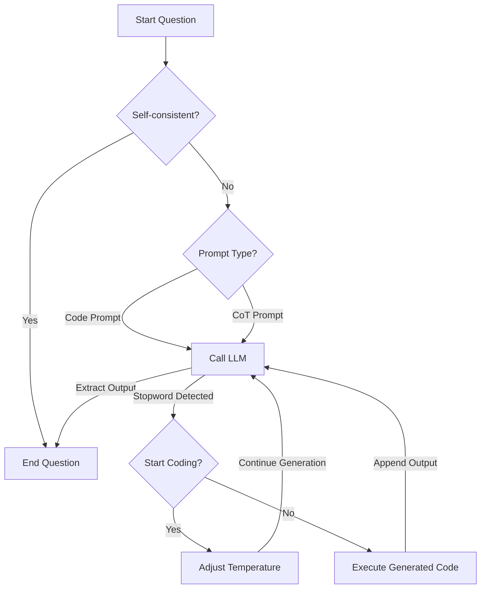

For decades, the path to high school mathematical glory has been a straightforward one. Students with an aptitude for problem-solving would spend years practicing in quiet libraries, under the watchful eyes of devoted coaches, with the unspoken understanding that success was the result of talent, perseverance, and grit. For many, the pinnacle of this journey was the International Mathematical Olympiad (IMO) — a test of logic and creativity that thrust unknown prodigies into the public spotlight.

But that path now looks more fragile than ever. In recent years, a cheating scandal[^wsj] has shaken the foundations of high-school math competitions across the globe. At the heart of it is the American Mathematics Competitions (AMC), a series of tests that serve as the gateway to the IMO for U.S. students. What was once a meritocratic proving ground is now mired in controversy, as whispers of leaked test questions have grown into full-throated accusations.

The scandal broke wide open after the discovery that entire exams — from initial qualifying rounds to the elite-level USA Mathematical Olympiad (USAMO) — were being leaked online. Test questions, sometimes accompanied by answers, appeared on TikTok and in private chat groups just hours before students sat for the exam. The leaks gave some students an illicit advantage, tilting the scales in a contest where even a single point can mean the difference between a life-changing scholarship and a disappointing rejection letter.

The reaction was swift and visceral. Parents, students, and coaches — many of whom had dedicated years to preparing for these competitions — demanded reform. Stories circulated of students achieving inexplicably high scores, their success suddenly under suspicion. The Mathematical Association of America (MAA), which runs the AMC, was forced to confront the crisis. They disqualified some students, scrambled the order of multiple-choice answers, and tightened control over test distribution.

Yet the damage had already been done. The AMC is no ordinary high-school math test. For many students, it’s a golden ticket. A top score can open the gates to MIT, Caltech, and other top universities. It’s a signal to hedge funds and quantitative trading firms that this teenager might have what it takes to crack markets as easily as they crack equations. The stakes were always high, but now, with cheating on the rise, every score is viewed with suspicion.

This past year, the U.S. team went on to claim its ninth International Mathematical Olympiad title, a victory that should have been a moment of pride. Instead, it felt tainted. While the IMO itself remained free from scandal, the selection process leading up to it had been compromised. If the integrity of the AMC is in doubt, then so too is the legitimacy of the Olympiad team that it produces.

The story of this scandal has the feel of a parable — a world of bright minds and sharp incentives meeting the disruptive forces of technology. In past eras, cheating required elaborate schemes: crib sheets, planted spies, or bribes. But in the TikTok age, it’s as simple as a screenshot uploaded to the right group chat. This shift from analog to digital subterfuge is one that the MAA and other competition organizers have struggled to counter. But there’s another shift coming, one that might render all these efforts obsolete.

Because in a few years, it might not matter at all. By then, the brightest "contestants" in the International Mathematical Olympiad may not be humans at all. They’ll be a new breed of contender: the automated math problem solver. Powered by advances in artificial intelligence, these models — trained on terabytes of mathematical data and refined through billions of self-improvement cycles — may soon match or surpass the world’s best teenage minds. The IMO, for all its tradition, might soon become a battle not between nations, but between AI models.


<blockquote markdown="1">
**What Are the Different Types of Mathematical Reasoning Problems?**[^survey]

Try answering a question from each of the four categories.

1. **Math word problem solving (MWP):** arithmetic problems where the main challenge is translating natural language into mathematical operations.

   *Question:* Bod has 2 apples and David has 5 apples. How many apples do they have in total?

   <details markdown="1">
   <summary>Answer</summary>
   7
   </details> 

2. **Theorem proving (TP):** problems that require formally or informally proving a mathematical claim through logical arguments.

   *Question:* Prove that the sum of two natural numbers is associative.

   ```coq
   Theorem add_assoc:
     forall a b c : nat, (a + b) + c = a + (b + c).
   ```
   <details markdown="1">
   <summary>Answer</summary>
   ```coq
   Proof.
     intros a b c.
     induction a as [|a'].
     + trivial.
     + simpl; rewrite IHa'. trivial.
   Qed.
   ```
   </details> 

3. **Geometry problem solving (GP):** problems involving a text description and a geometric diagram, where the goal is to find a numeric solution to an unknown variable.

   *Question:* In triangle $$ABC$$, $$AD = 3$$ and $$BD = 14$$. Find $$CD$$.

   

   *Choices:* Ⓐ 6.0 Ⓑ 6.5 Ⓒ 7.0 Ⓓ 8.5

   <details markdown="1">
   <summary>Answer</summary>
   *Choices:* Ⓐ 6.0 ⬤ 6.5 Ⓒ 7.0 Ⓓ 8.5
   </details> 

4. **Math question answering (MathQA):** general problems that require mathematical reasoning.

   *Question:* A train running at the speed of 48 km/h crosses a pole in 9 seconds. What is the length of the train?

   *Choices:* Ⓐ 140 Ⓑ 130 Ⓒ 120 Ⓓ 170 Ⓔ 160

   <details markdown="1">
   <summary>Answer</summary>
   *Choices:* Ⓐ 140 Ⓑ 130 ⬤ 120 Ⓓ 170 Ⓔ 160
   </details> 
</blockquote>

## From Logic Theorist to AlphaProof

In 1956, a computer program called "Logic Theorist" stunned the world by proving 38 of the first 52 theorems in Whitehead and Russell’s *Principia Mathematica*. It was hailed as a milestone in artificial intelligence, a glimpse of a future where machines might one day reason like humans. But in the decades that followed, progress on AI-driven mathematical reasoning was slow. The path to true "mathematical intuition" — the ability to synthesize concepts, spot elegant solutions, and navigate the logical maze of proofs — remained elusive. For most of the 20th century, theorem-proving machines were brittle, domain-specific, and limited to tasks like chess, which operated within clear, predefined rules. The dream of a general AI mathematician felt as distant as ever.

It took more than half a century later for things to start changing. In the 2010s, as deep learning revolutionized fields like natural language processing (NLP), image recognition, and game playing, a new surge of interest focused on an old ambition: teaching machines to "think" mathematically. The field of mathematical reasoning, once a niche academic curiosity, became a global research race. Neural networks, transformers, and large language models (LLMs) like OpenAI's GPT-3 began showing flashes of "reasoning" ability. Early attempts focused on solving math word problems, using sequence-to-sequence models to map natural language descriptions to equations. But soon, the ambitions grew larger. Researchers wondered: Could these models solve problems from high-stakes math competitions? Could an AI one day win the International Mathematical Olympiad (IMO)?

At first, the idea seemed laughable. The IMO’s problems, with their subtle logic, creativity, and multi-step reasoning, felt fundamentally "human." But the laughter shifted to unease as AI systems began to make real progress. In late 2018, Google DeepMind’s AlphaZero stunned the world by mastering Go, chess, and shogi from scratch — not through rote memorization, but through self-play and iterative improvement. Many researchers wondered if the same approach could work for math.

Over the next five years, those doubts would evaporate as research groups across the world raced to build "general reasoning" models. Chain-of-thought prompting emerged as a breakthrough technique, enabling large language models to break down problems step-by-step. With careful prompts like "Let’s think step by step," AI models could now explain their reasoning processes. Results on competitive benchmarks like MATH and GSM8K surged.

In 2023, whispers began circulating. Reports suggested that an experimental AI model at DeepMind had managed to solve an IMO problem during testing. Soon, researchers there confirmed that their models had successfully tackled a small subset of IMO questions — problems that had historically stumped even elite human competitors. The next year, DeepMind achieved a historic milestone when an ensemble of two models — AlphaProof and AlphaGeometry 2 — earned a silver medal at the IMO. The system solved the hardest problem in the competition, a number theory challenge that stumped all but five human contestants. While the AI took three days to solve this single problem — compared to the nine hours given to human participants to solve all six — it marked a breakthrough in AI-driven mathematical reasoning. Together, the models scored 28 points out of 42, just one point short of the gold-medal threshold. Described as “well beyond the state of the art” by Fields Medalist Sir Timothy Gowers, the achievement demonstrated that machines can approach the highest levels of mathematical abstraction and creativity, once thought to be uniquely human.

<blockquote markdown="1">

**New Tools for Old Goals**

While the goal of building an AI that can master mathematics is old, the tools of this race are new and in constant evolution. Below are a few techniques that have improved the performance of large language models (LLMs) on mathematical reasoning.

1. **Fine-Tuning:** Fine-tuning builds on pre-trained models by adapting them to specific tasks using curated datasets, refining their performance in a targeted domain[^finetuning]. In mathematical reasoning, fine-tuning often leverages datasets containing competition-level questions like AIME and MATH to instill problem-solving techniques relevant to human mathematicians.

2. **Chain-of-Thought (CoT):** Chain-of-thought prompting revolutionized AI reasoning by encouraging models to "show their work"[^cot]. Instead of asking for a direct answer, models are prompted to walk through each step of the reasoning process. By breaking down problems into a sequence of logical steps, models achieve far greater transparency and accuracy.

3. **Program-aided Language Models (PAL):**: Program-Aided Language Models (PAL)[^pal] integrate code execution with natural language reasoning to tackle complex problems. Instead of generating text-based solutions, these models translate questions into executable programs that calculate answers, ensuring logical consistency and correctness.

4. **Self-Correction:** Self-correction leverages the iterative nature of large language models (LLMs) to refine outputs by learning from their own errors[^pal], particularly in tasks involving program synthesis or structured reasoning. When a model generates code with errors—whether due to logical flaws or syntax issues—the stack traces or failure outputs are fed back into the model as part of the prompt. The model uses this feedback to regenerate corrected solutions, mimicking how a human programmer would iteratively debug code.

5. **Self-Consistency:** Self-consistency sampling aggregates multiple reasoning paths instead of relying on a single prediction[^selfconsistency]. Traditional models generate a single answer, but self-consistency takes multiple attempts at a problem and then uses majority voting to select the most consistent answer. This approach significantly improves reliability, as incorrect reasoning paths are more likely to diverge from each other, while correct paths tend to converge on the same answer.

</blockquote>

## Artificial Intelligence Mathematical Olympiad Prize

In November 2023, the Artificial Intelligence Mathematical Olympiad (AIMO) Prize was launched, marking an ambitious milestone in AI research. Its goal is clear: to encourage the creation of an AI system capable of achieving a gold medal at the International Mathematical Olympiad (IMO), with strict transparency requirements and computational constraints.

Funded by XTX Markets, the AIMO Prize offers $10 million in incentives to accelerate progress. The grand prize of $5 million will go to the first AI to achieve gold-medal performance in an AIMO-sanctioned competition. The remaining $5 million is allocated to two incremental progress prizes, rewarding intermediate breakthroughs that advance the field of mathematical reasoning.

The competition is hosted on Kaggle, a platform well-suited for large-scale AI competitions. Kaggle provides a neutral environment where participants worldwide can compete on equal footing. Public leaderboards and open notebooks allow for shared progress and collaboration, in keeping with the AIMO’s emphasis on transparency and reproducibility. The Kaggle environment also enforces strict computational limits. Submissions are evaluated on accuracy and must run within 9 hours on CPU or GPU, with internet access disabled during execution. Participants can use freely available external data and pre-trained models, but proprietary, undisclosed datasets are prohibited.

The competition’s core task involves solving 110 new mathematical problems, modeled after high school-level competition problems. 50 problems each are allocated to the public and private leaderboards and the remaining 10 problems are given as training data. An international team of problem-setters carefully crafted these problems to prevent train-test leakage — a common issue in AI research where models perform well by “memorizing” problems from their training data.

### Early Sharing Prize

An early milestone, the $10,000 Early Sharing Prize, was awarded to the first team to publicly share a solution that achieved a meaningful score of at least 20/50 on the public leaderboard. This prize encouraged teams to contribute to a shared pool of knowledge, reinforcing the collaborative spirit of the competition.

#### AbdurRafae 🏅

On April 22, 2024, the Early Sharing Prize was won by Abdur Rafae for his notebook [Improved Code Interpretation](https://www.kaggle.com/code/abdurrafae/improved-code-interpretation). Rafae’s approach laid the groundwork for the strategies that would go on to define the competition’s later stages. His solution achieved this by employing a variety of techniques:

- **Model Selection:** Utilizing the [DeepSeek-Math-7B RL](https://huggingface.co/deepseek-ai/deepseek-math-7b-rl) model made the solution more robust and reliable.
- **Resource Management:** Adopting a round-robin strategy to iterate over questions and enforcing a 7-second timeout for code execution.
- **Dynamic Prompting:** Switching between code and text prompts based on previous attempts.
- **Code Execution:** Generating [SymPy](https://www.sympy.org/en/index.html) code and setting symbols to `real` to avoid complex numbers.
- **Self-correction:** Creating a feedback loop where stack traces and outputs were re-fed into the model for iterative improvement.
- **Self-consistency:** Applying majority voting and stopping early when answers are self-consistent.

<figure>

<figcaption>AbdurRafae's Inference Workflow</figcaption>
</figure>

### Progress Prize 1

On June 28, 2024, the competition reached its first major milestone as the first stage of the competition was closed to submissions and the first Progress Prize[^aimo1] was awarded. With a prize pool of $1,048,576 distributed among the top five teams, this phase sees the winners make significant improvements over the solution from the early sharing prize.

<figure class="tabular-nums overflow-x-auto" markdown="1">
<figcaption>Summary of Prize-winning Solutions</figcaption>

| # | Team        | Score | Model(s)                 | Fine-tuned | Candidates | Iterations | Inference |
| - | ----------- | ----- | ------------------------ | ---------- | ---------- | ---------- | --------- |
| 1 | Numina      | 29/50 | DeepSeek-Math-7B Base    | ✔          | 48         | 4          | vLLM      |
| 2 | CMU Math    | 22/50 | DeepSeek-Math-7B Base/RL | ✔          | 42         | 2          | vLLM      |
| 3 | After Exams | 21/50 | DeepSeek-Math-7B RL      | ✗          | 120–160    | >6         | vLLM      |

</figure>

#### Numina 🥇

[Solution](https://www.kaggle.com/competitions/ai-mathematical-olympiad-prize/discussion/519303)
[Notebook](https://www.kaggle.com/code/lewtun/numina-1st-place-solution)

Numina, a team composed of Hugging Face employees, secured the first-place spot using the two-stage fine-tuning strategy outlined in MuMath-Code[^mumath] on DeepSeek-Math-7B Base. The result was a powerful reasoning agent that could solve mathematical problems via a mix of natural language reasoning and code execution to compute intermediate results. Their solution generated 48 candidate answers for each question, incorporated self-correction through tool-integrated reasoning to a depth of 4, and applied a self-consistent voting mechanism. The result was a model that was able to solve 29/50 problems, earning it the top spot in the competition.

#### CMU Math 🥈

[Solution](https://www.kaggle.com/competitions/ai-mathematical-olympiad-prize/discussion/518964)
[Notebook](https://www.kaggle.com/code/edwardsun0909/aimo-2nd-place-solution)

The second-place winner, CMU Math, comprising of a single participant, used a sophisticated fine-tuning strategy by leveraging two DeepSeek-Math-7B models: a policy model for generating solutions and a reward model for scoring them, which were combined using weighted majority voting. The policy model was fine-tuned on the AMC, AIME, and Odyssey-Math datasets, filtering out multiple-choice questions and non-integer answers to improve precision. The reward model employed a hybrid approach to generate positive/negative solutions: (i) interpolating parameters between the base and RL versions of the model for the MATH dataset; and (ii) fine-tuning DeepSeek-Math-7B RL on the AIME, AMC, and Odyssey-Math datasets. This yielded a reward model with balanced labels yet diverse solutions. At inference time, 42 candidate programs were generated by the policy model for each question, with the model retrying if the result of the code execution was not an integer. The reward model would then score these solutions, and a modified weighted majority voting mechanism (calculating the geometric mean instead of the arithmetic mean) would select the best solution.

#### After Exams 🥉

[Solution](https://www.kaggle.com/competitions/ai-mathematical-olympiad-prize/discussion/517206) [Notebook](https://www.kaggle.com/code/davidd2/3rd-place-solution-afterexams/notebook)

Earning third place, After Exams took a unique approach by using DeepSeek-Math-7B RL without any fine-tuning, demonstrating the potential of off-the-shelf models in mathematical reasoning. To optimize performance, they implemented parallelized code execution, which allowed them to generate 120-160 candidates per question. Additionally, they devised a custom scoring rule that penalized solutions involving small numbers (less than 10) or answers directly found in the problem statement, ensuring that their model prioritized more meaningful and non-trivial solutions.

## Towards Progress Prize 2 and Beyond

Building on the success of its predecessor, Progress Prize 2 introduces a fresh set of 110 carefully designed problems spanning algebra, combinatorics, geometry, and number theory, reflecting the diverse challenges faced by top human mathematicians. With a larger prize pool of $2.1 million and upgraded computational resources, including powerful L4×4 machines equipped with 96GB GPU memory, the stakes are higher than ever.

The competitive landscape has also evolved. Teams now have access to new models, with DeepSeek leading the way. Widely regarded as the model of choice for all prize-winning teams in Progress Prize 1, DeepSeek has released two major updates: DeepSeek-V3[^deepseek-v3], which outperforms both Meta's open-source Llama 3.1 405B Instruct and OpenAI's closed-source GPT-4o on benchmarks like AIME and MATH, and DeepSeek-R1[^deepseek-r1], a specialized reasoning model that excels at tackling mathematical problems. These advances reflect the rapid pace of innovation in the field, setting a high bar for entrants in the new competition cycle.

The AIMO Progress Prize 2 will run from December 17, 2024, to March 17, 2025. For those eager to participate, [the competition is hosted on Kaggle](https://www.kaggle.com/competitions/ai-mathematical-olympiad-progress-prize-2), where teams from across the globe can register, collaborate, and compete on an equal footing. Whether through incremental improvements or transformative breakthroughs, the race for Progress Prize 2 is set to push the limits of what AI can achieve in mathematical problem-solving — and bring us closer to the dream of true mathematical intuition in machines.

## References

[^aimo1]: Frieder, S., Bealing, S., Nikolaiev, A., Smith, G. C., Buzzard, K., Gowers, T., Liu, P. J., Loh, P. S., Mackey, L., Moura, L. de, Roberts, D., Sculley, D., Tao, T., Balduzzi, D., Coyle, S., Gerko, A., Holbrook, R., Howard, A., and XTX Markets. [AI Mathematical Olympiad: Progress Prize 1.](https://kaggle.com/competitions/ai-mathematical-olympiad-prize) (2024). *Kaggle.*

[^aimo2]: Frieder, S., Bealing, S., Nikolaiev, A., Smith, G. C., Buzzard, K., Gowers, T., Liu, P. J., Loh, P. S., Mackey, L., Moura, L. de, Roberts, D., Sculley, D., Tao, T., Balduzzi, D., Coyle, S., Gerko, A., Holbrook, R., Howard, A., and XTX Markets. [AI Mathematical Olympiad: Progress Prize 2.](https://kaggle.com/competitions/ai-mathematical-olympiad-progress-prize-2) (2024.) *Kaggle.*

[^cot]: Wei, J., Wang, X., Schuurmans, D., Bosma, M., Xia, F., Chi, E., ... & Zhou, D. (2022). [Chain-of-thought prompting elicits reasoning in large language models.](https://arxiv.org/abs/2201.11903) *Advances in neural information processing systems, 35, 24824-24837.*

[^deepmind]: Google DeepMind. (2024). [AI achieves silver-medal standard solving International Mathematical Olympiad problems.](https://deepmind.google/discover/blog/ai-solves-imo-problems-at-silver-medal-level/) *Google DeepMind Blog.*

[^deepseek-r1]: Guo, D., Yang, D., Zhang, H., Song, J., Zhang, R., Xu, R., ... & He, Y. (2025). [DeepSeek-R1: Incentivizing Reasoning Capability in LLMs via Reinforcement Learning.](https://arxiv.org/abs/2501.12948) *arXiv preprint arXiv:2501.12948.*

[^deepseek-v3]: Liu, A., Feng, B., Xue, B., Wang, B., Wu, B., Lu, C., ... & Piao, Y. (2024). [DeepSeek-V3 Technical Report.](https://arxiv.org/abs/2412.19437) *arXiv preprint arXiv:2412.19437*.

[^finetuning]: Wei, J., Bosma, M., Zhao, V. Y., Guu, K., Yu, A. W., Lester, B., ... & Le, Q. V. (2021). [Finetuned language models are zero-shot learners.](https://arxiv.org/abs/2109.01652) *arXiv preprint arXiv:2109.01652.*

[^mumath]: Yin, S., You, W., Ji, Z., Zhong, G., & Bai, J. (2024). [MuMath-Code: Combining Tool-Use Large Language Models with Multi-perspective Data Augmentation for Mathematical Reasoning.](https://arxiv.org/abs/2405.07551) *arXiv preprint arXiv:2405.07551.*

[^pal]: Gao, L., Madaan, A., Zhou, S., Alon, U., Liu, P., Yang, Y., ... & Neubig, G. (2023, July). [PAL: Program-aided language models.](https://arxiv.org/abs/2211.10435) *In International Conference on Machine Learning (pp. 10764-10799). PMLR.*

[^selfconsistency]: Wang, X., Wei, J., Schuurmans, D., Le, Q., Chi, E., Narang, S., ... & Zhou, D. (2022). [Self-consistency improves chain of thought reasoning in language models.](https://arxiv.org/abs/2203.11171) *arXiv preprint arXiv:2203.11171.*

[^survey]: Lu, P., Qiu, L., Yu, W., Welleck, S., & Chang, K. W. (2022). [A survey of deep learning for mathematical reasoning.](https://arxiv.org/abs/2212.10535) *arXiv preprint arXiv:2212.10535.*

[^wsj]: Surjadi, M., & Randazzo, S. (2024). [The Cheating Scandal Rocking the World of Elite High-School Math.](https://www.wsj.com/us-news/education/math-competition-cheating-scandal-acb0cde9) *The Wall Street Journal.*
